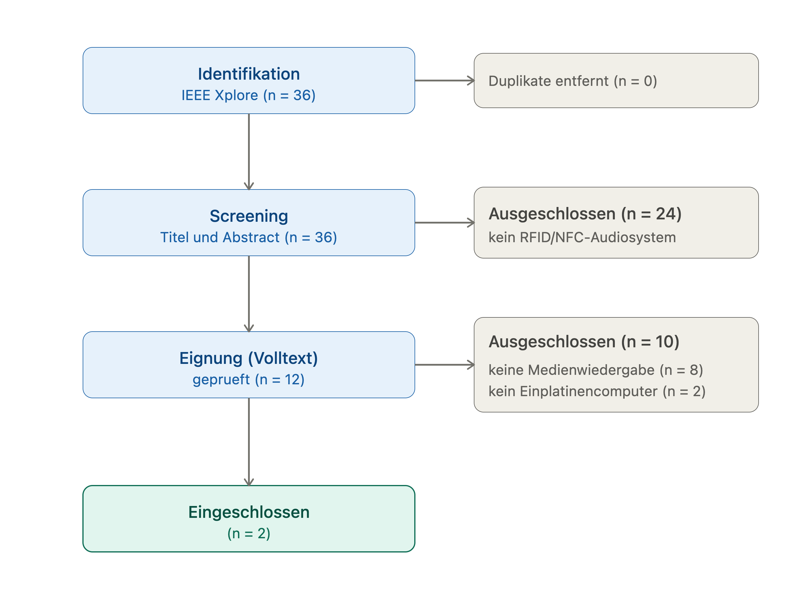

# 🎵 Phoniebox – RFID-basierte Musikbox mit Raspberry Pi

> Eine Musikbox, die per RFID-Karte gesteuert wird: Karte auflegen → Musik läuft.
> Projekt im Modul **App Development**, Hochschule Niederrhein, Sommersemester 2026.

Dieses Repository dokumentiert unseren Aufbau und die Erweiterung einer **Phoniebox** –
einer Musikbox, die ohne klassische Bedienoberfläche allein über RFID-Karten oder
-Chips bedient wird. Sie eignet sich z. B. für Kinder, Lerninhalte oder eine einfache
Mediensteuerung.

> ℹ️ **Hinweis zur Herkunft des Codes:** Der größte Teil dieses Repositorys ist die
> Original-Software des Open-Source-Projekts
> [MiczFlor/RPi-Jukebox-RFID](https://github.com/MiczFlor/RPi-Jukebox-RFID)
> (Ordner `components/`, `scripts/`, `ci/`, `misc/` …). **Unser eigener Anteil** liegt in
> der praktischen Umsetzung, Konfiguration und Dokumentation und ist in dieser README
> sowie im Ordner [`dokumentation/`](dokumentation/) gebündelt.

---

## Inhaltsverzeichnis

- [Über das Projekt](#über-das-projekt)
- [Projektziele](#projektziele)
- [Hardware](#hardware)
- [Software](#software)
- [Architektur](#architektur)
- [Einrichtung](#einrichtung)
- [Probleme & Lösungen](#probleme--lösungen)
- [Statusanzeige für den RFID-Leser](#statusanzeige-für-den-rfid-leser)
- [Messdaten](#messdaten)
- [Repository-Struktur](#repository-struktur)
- [Eigener Projektanteil](#eigener-projektanteil)
- [Team](#team)
- [Lizenz & Credits](#lizenz--credits)

---

## Über das Projekt

Die Grundidee: Eine RFID-Karte wird an einen Reader gehalten und löst dadurch einen
bestimmten Audioinhalt aus. So lässt sich die Musikbox komplett ohne Bildschirm oder
Tasten bedienen.

Als technische Grundlage nutzen wir das bestehende Open-Source-Projekt
**RPi-Jukebox-RFID**. Unser Fokus liegt darauf, die Software auf **unserer** Hardware
lauffähig zu machen, die Komponenten zu verstehen, sauber zu konfigurieren und die
aufgetretenen Probleme samt Lösungen zu dokumentieren.

## Projektziele

| Status | Ziel |
|:------:|------|
| ✅ | Raspberry Pi als zentrale Steuereinheit einrichten |
| ✅ | Phoniebox-Software installieren und konfigurieren |
| ✅ | RFID-/NFC-Reader anschließen und testen |
| ✅ | Audioinhalte über RFID-Karten steuern |
| ✅ | Audioausgabe über Lautsprecher **und Bluetooth** testen |
| ✅ | Einrichtung, Probleme und Lösungsansätze dokumentieren |
| ✅ | Eigene Live-Statusanzeige für den RFID-Leser programmiert |

## Hardware

| Komponente | Verwendetes Modell |
|------------|--------------------|
| Einplatinencomputer | Raspberry Pi 4 Model B |
| RFID-/NFC-Reader | z. B. PN532 |
| Karten/Chips | RFID-Karten oder -Chips |
| Audioausgabe | Lautsprecher über Klinke **oder Bluetooth** (z. B. JBL Flip 6) |
| Stromversorgung | Netzteil und Verbindungskabel |

## Software

| Tool | Zweck |
|------|-------|
| Raspberry Pi OS Lite | Betriebssystem |
| RPi-Jukebox-RFID | Phoniebox-Basissoftware |
| Mopidy / MPD | Musik-Player (Wiedergabe) |
| PipeWire / PulseAudio | Audio-Ausgabe (inkl. Bluetooth) |
| Git & GitHub | Versionierung und Dokumentation |
| Terminal / VS Code | Einrichtung und Bearbeitung |

## Architektur

Ablauf von der Karte bis zur Musik:



## Einrichtung

Eine Schritt-für-Schritt-Anleitung zur Einrichtung, zu nützlichen Terminal-Befehlen
und zum Hochladen von Daten auf GitHub findet sich hier:

➡️ **[`dokumentation/einrichtung.md`](dokumentation/einrichtung.md)**

Ein Beispiel zur MPD-/Audio-Konfiguration:

➡️ **[`dokumentation/beispiel-mpd-konfiguration.md`](dokumentation/beispiel-mpd-konfiguration.md)**

## Probleme & Lösungen

Die während des Projekts aufgetretenen Probleme und ihre Lösungen sind ausführlich
dokumentiert in:

➡️ **[`dokumentation/fehlerbehebung.md`](dokumentation/fehlerbehebung.md)**

Kurzüberblick:

| Problem | Ursache | Lösung |
|---------|---------|--------|
| Bluetooth-Box verbunden, aber kein Ton | Mopidy gab den Ton an `alsasink` (interne Soundkarte) aus, an PipeWire/Bluetooth vorbei | Ausgabe auf `pulsesink` umgestellt, Mopidy im Ton-Kontext von Benutzer `pi` laufen lassen, Bluetooth-Box als Standard-Ausgang gesetzt |
| RFID-Reader liest keine Karten mehr | Reader-Prozess hängt | `sudo systemctl restart phoniebox-rfid-reader.service` |
| Login beim `git push` scheitert | GitHub akzeptiert kein Passwort mehr | Personal Access Token statt Passwort verwenden |

## Statusanzeige für den RFID-Leser

Als **weitere Erweiterung** haben wir eine kleine Weboberflächen-Seite programmiert, die
**live anzeigt, ob der NFC-/RFID-Leser einwandfrei funktioniert**. Auslöser war unser
Problem, dass der Leser zwischenzeitlich keine Karten mehr erkannt hat – mit der Anzeige
sieht man den Zustand nun auf einen Blick.

Die Seite (`rfid-status.php`) fragt alle 2 Sekunden den Dienst
`phoniebox-rfid-reader.service` ab und zeigt einen großen Statuspunkt:

- 🟢 **grün, pulsierend** – der RFID-Leser läuft einwandfrei
- 🔴 **rot** – der Leser reagiert nicht (Abhilfe: `sudo systemctl restart phoniebox-rfid-reader.service`)

**Aufruf im Browser:** `localhost/rfid-status.php`

Umgesetzt als eigenständige PHP-Seite, damit die originale Phoniebox-Oberfläche
(`index.php`) unverändert und stabil bleibt. Technisch prüft sie den Dienststatus per
`systemctl is-active` und aktualisiert sich per JavaScript automatisch.

## Messdaten

Eigene Messungen (z. B. die Reaktionszeit des Chiplesers) werden gesammelt in:

➡️ **[`messdaten/`](messdaten/)**

## Repository-Struktur

```
.
├── README.md                     # Diese Übersicht (unser Projekt)
├── rfid-status.php               # 👈 UNSERE Live-Statusanzeige für den RFID-Leser
├── dokumentation/                # 👈 UNSERE eigene Dokumentation
│   ├── einrichtung.md            #     Setup & Terminal-Befehle
│   ├── fehlerbehebung.md         #     Probleme & Lösungen
│   ├── beispiel-mpd-konfiguration.md
│   └── architektur-flowchart.png
├── messdaten/                    # 👈 UNSERE Messungen (z. B. Reaktionszeit)
├── playlists/                    # 👈 UNSERE Playlists (Lied_2, musik)
│
├── components/                   # Original-Phoniebox-Software (Upstream)
├── scripts/                      # Original-Phoniebox-Skripte (Upstream)
├── ci/                           # Original: Build-/Test-Konfiguration (Upstream)
├── misc/                         # Original: Beispiel-Audiodateien (Upstream)
├── requirements*.txt             # Original: Python-Abhängigkeiten (Upstream)
└── packages*.txt                 # Original: Systempakete (Upstream)
```

> 👈 markiert die von uns erstellten bzw. gepflegten Bereiche. Alles andere gehört zur
> Original-Software und dient als Grundlage.

## Eigener Projektanteil

Da die Phoniebox-Software bereits als Open-Source-Projekt existiert, besteht unser
eigener Anteil vor allem aus **praktischer Umsetzung, Konfiguration, Fehleranalyse und
Dokumentation**:

1. Recherche zur bestehenden Phoniebox-Software
2. Installation und Einrichtung auf dem Raspberry Pi
3. Anschluss und Test des RFID-/NFC-Readers
4. Prüfung der Hardwareverbindung
5. Test der Audioausgabe (Klinke und Bluetooth)
6. Analyse und Lösung von Problemen bei Bluetooth und Tonwiedergabe
7. Dokumentation wichtiger Terminal-Befehle
8. Strukturierung des GitHub-Repositorys
9. Messung der Reaktionszeit des Chiplesers
10. Programmierung einer eigenen Live-Statusanzeige für den RFID-Leser (`rfid-status.php`)
11. Planung möglicher Erweiterungen

**Geplante Erweiterungen:** keine 

## Team

- Yassin
- Aziz
- Melina

## Lizenz & Credits

Dieses Projekt basiert auf der Open-Source-Software
[MiczFlor/RPi-Jukebox-RFID](https://github.com/MiczFlor/RPi-Jukebox-RFID).
Die ursprüngliche Software wurde **nicht** von uns entwickelt – siehe [`LICENSE`](LICENSE).
Wir verwenden sie als Grundlage für unser App-Development-Projekt und dokumentieren
unsere eigene Einrichtung, Konfiguration und Erweiterungsideen.

---

*Modul: App Development · Hochschule Niederrhein · Sommersemester 2026*
